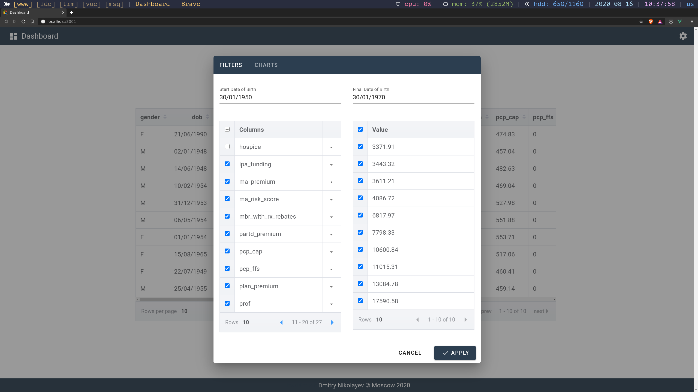
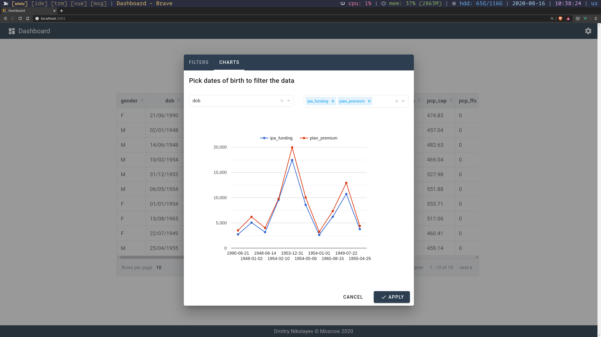

# Running web application

1. Start server
yarn api

2. Start client
yarn start

Tune filters and press apply button to see the changes in the dashboard screen

Choose variables for analysis and press apply button to build the chart

Let see how it goes on large amounts of data

